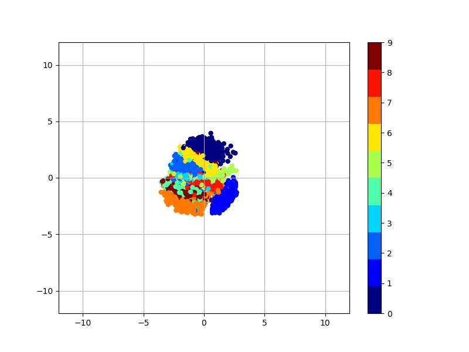
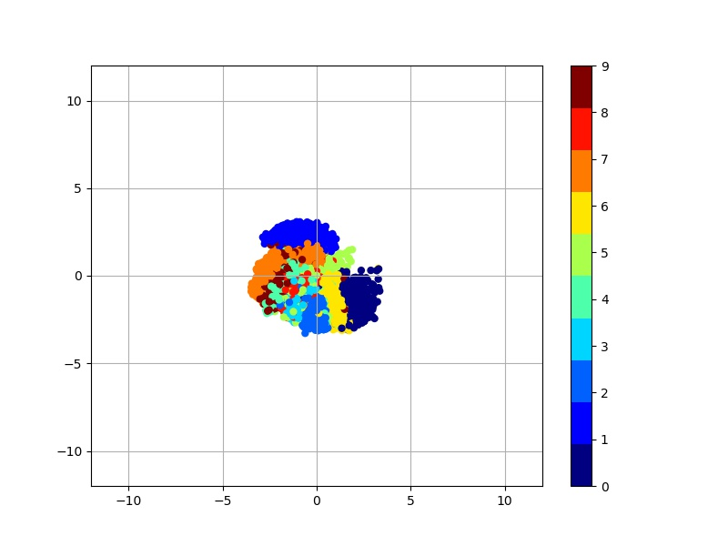
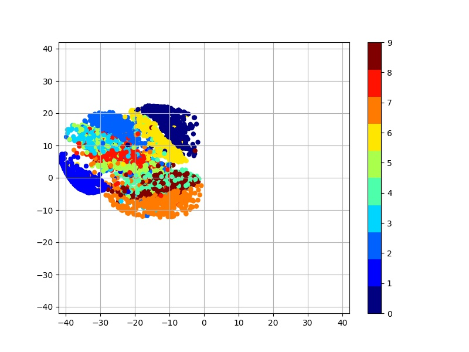
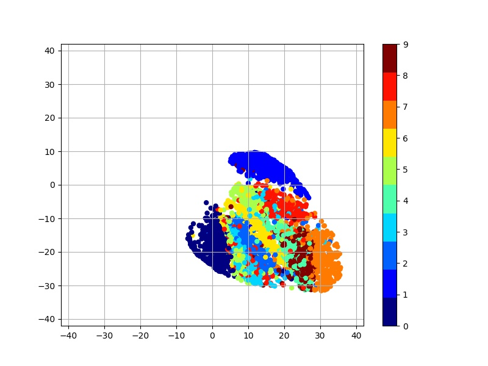
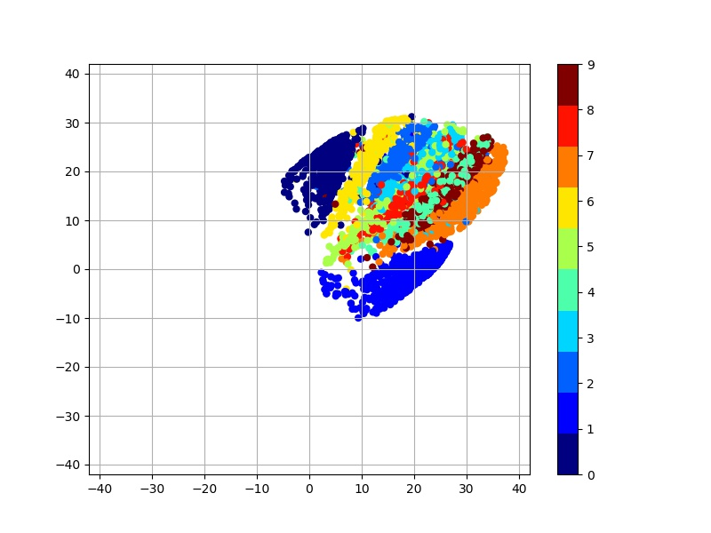
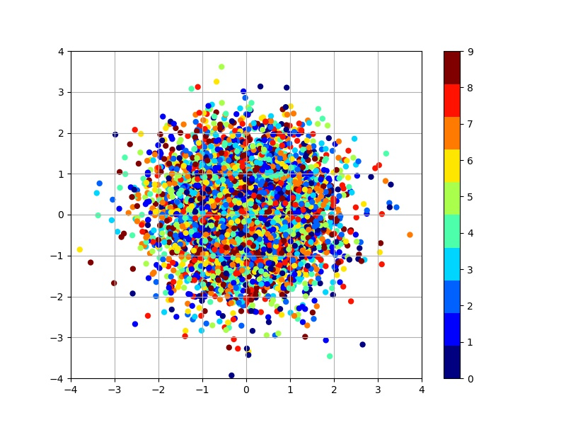
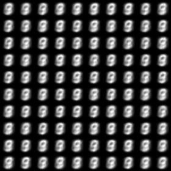
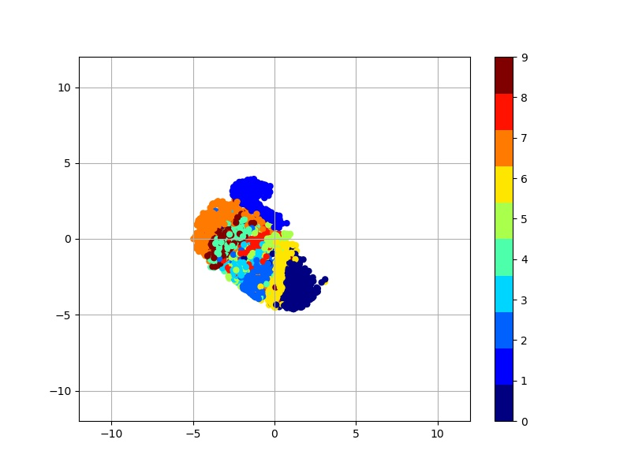
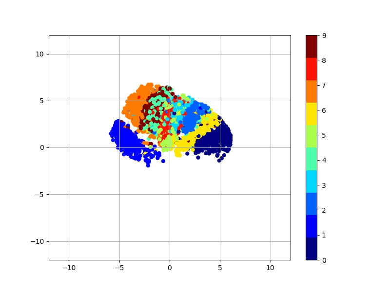
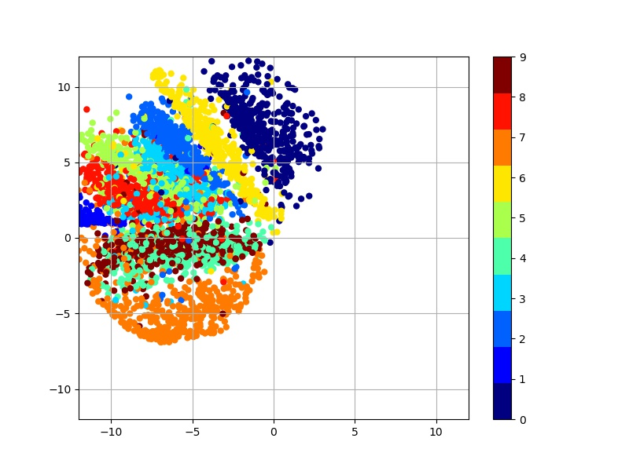

# Variational Auto-Encoder for MNIST
An implementation of variational auto-encoder (VAE) for MNIST descripbed in the paper:  
* [Auto-Encoding Variational Bayes](https://arxiv.org/pdf/1312.6114) by Kingma et al.
## Modification
- Vanilla Autoencoder와 비교해가며 실험할 수 있도록 구현.
- Encoder 없이 Normal Dist에서 바로 Decoder로 가는 모델을 실험할 수 있도록 argument를 추가. 
- KL loss term의 weight를 argument로 변형할 수 있도록 수정.  

```
--vanilla_ae_mode : vanilla autoencoder mode if specified
--no_encoder_mode : no encoder mode if specified
--KL_beta : beta weight of KL loss term(default = 1.0)
```
### latent space VAE vs AE
VAE는 latent space가 정규분포로 맞추어지지만, AE는 실행할 때마다 다른 분포의 manifold를 학습한다. 
```
python run_main.py --dim_z <each value> --vanilla_ae_mode
``` 
<table align='center'>
<tr align='center'>
<td> VAE </td>
<td> VAE </td>
<td> AE </td>
<td> AE </td>
<td> AE </td>
</tr>
<tr>
<td>
<td>
<td>
<td>
<td>
</tr>
</table>

### Naiive approach of VAE
Encoder 없이 VAE를 학습할 경우, latent space는 정규분포를 따르지만 generation 결과가 좋지 못하다. 
```
python run_main.py --dim_z <each value> --no_encoder_mode
``` 
<table align='center'>
<tr align='center'>
<td> MNIST manifold (normal dist) </td>
<td> Generation results  </td>
</tr>
<tr>
<td>
<td>
</tr>
</table>


### Effect of KL-loss term
KL loss term의 가중치(beta)를 줄이면 줄일수록 manifold가 정규분포를 벗어난다. 즉 manifold학습보다는 reconstruction에 더욱 가중치를 두는 모델이 된다. 
```
python run_main.py --dim_z <each value> --KL_beta 0.1
``` 
<table align='center'>
<tr align='center'>
<td> beta=0.3 </td>
<td> beta=0.1 </td>
<td> beta=0.01 </td>
</tr>
<tr>
<td>
<td>
<td>
</tr>
</table>
 
## Results
### Reproduce
Well trained VAE must be able to reproduce input image.  
Figure 5 in the paper shows reproduce performance of learned generative models for different dimensionalities.  
The following results can be reproduced with command:  
```
python run_main.py --dim_z <each value> --num_epochs 60
``` 

<table align='center'>
<tr align='center'>
<td> Input image </td>
<td> 2-D latent space </td>
<td> 5-D latent space </td>
<td> 10-D latent space </td>
<td> 20-D latent space </td>
</tr>
<tr>
<td>
<td>
<td>
<td>
<td>
</tr>
</table>

### Denoising

When training, salt & pepper noise is added to input image, so that VAE can reduce noise and restore original input image.  
The following results can be reproduced with command:  
```
python run_main.py --dim_z 20 --add_noise True --num_epochs 40
```
<table align='center'>
<tr align='center'>
<td> Original input image </td>
<td> Input image with noise </td>
<td> Restored image via VAE </td>
</tr>
<tr>
<td>
<td>
<td>
</tr>
</table>

### Learned MNIST manifold
Visualizations of learned data manifold for generative models with 2-dim. latent space are given in Figure. 4 in the paper.  
The following results can be reproduced with command:  
```
python run_main.py --dim_z 2 --num_epochs 60 --PMLR True
```
<table align='center'>
<tr align='center'>
<td> Learned MNIST manifold </td>
<td> Distribution of labeled data  </td>
</tr>
<tr>
<td>
<td>
</tr>
</table>

## Usage
### Prerequisites
1. Tensorflow
2. Python packages : numpy, scipy, PIL(or Pillow), matplotlib

### Command
```
python run_main.py --dim_z <latent vector dimension>
```
*Example*:
`python run_main.py --dim_z 20`

### Arguments
*Required* :  
* `--dim_z`: Dimension of latent vector. *Default*: `20`

*Optional* :  
* `--results_path`: File path of output images. *Default*: `results`
* `--add_noise`: Boolean for adding salt & pepper noise to input image. *Default*: `False`
* `--n_hidden`: Number of hidden units in MLP. *Default*: `500`
* `--learn_rate`: Learning rate for Adam optimizer. *Default*: `1e-3`
* `--num_epochs`: The number of epochs to run. *Default*: `20`
* `--batch_size`: Batch size. *Default*: `128`
* `--PRR`: Boolean for plot-reproduce-result. *Default*: `True`
* `--PRR_n_img_x`: Number of images along x-axis. *Default*: `10`
* `--PRR_n_img_y`: Number of images along y-axis. *Default*: `10`
* `--PRR_resize_factor`: Resize factor for each displayed image. *Default*: `1.0`
* `--PMLR`: Boolean for plot-manifold-learning-result. *Default*: `False`
* `--PMLR_n_img_x`: Number of images along x-axis. *Default*: `20`
* `--PMLR_n_img_y`: Number of images along y-axis. *Default*: `20`
* `--PMLR_resize_factor`: Resize factor for each displayed image. *Default*: `1.0`
* `--PMLR_n_samples`: Number of samples in order to get distribution of labeled data. *Default*: `5000`

## References
The implementation is based on the projects:  
[1] https://github.com/oduerr/dl_tutorial/tree/master/tensorflow/vae  
[2] https://github.com/fastforwardlabs/vae-tf/tree/master  
[3] https://github.com/kvfrans/variational-autoencoder  
[4] https://github.com/altosaar/vae

## Acknowledgements
This implementation has been tested with Tensorflow r0.12 on Windows 10.

## modified
add 'is_vae' and 'is_encoder' mode to check 
